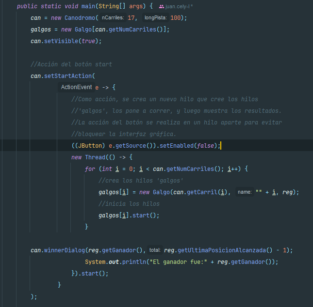
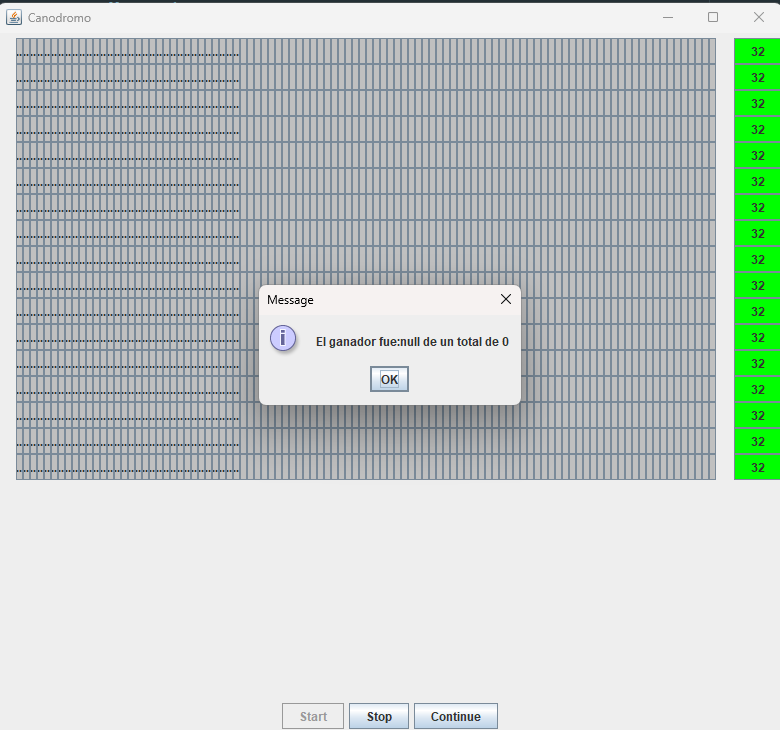
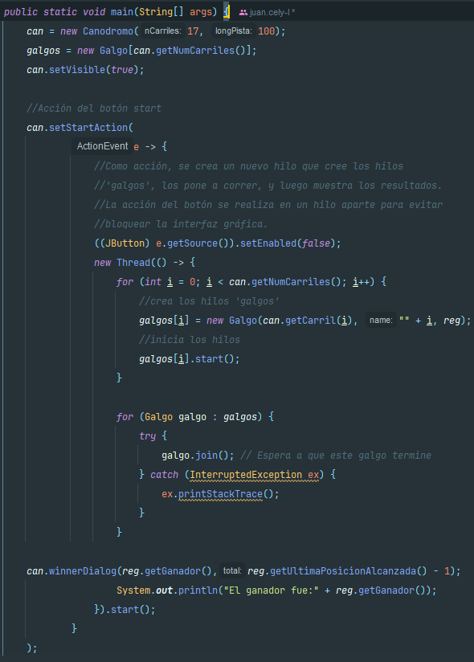
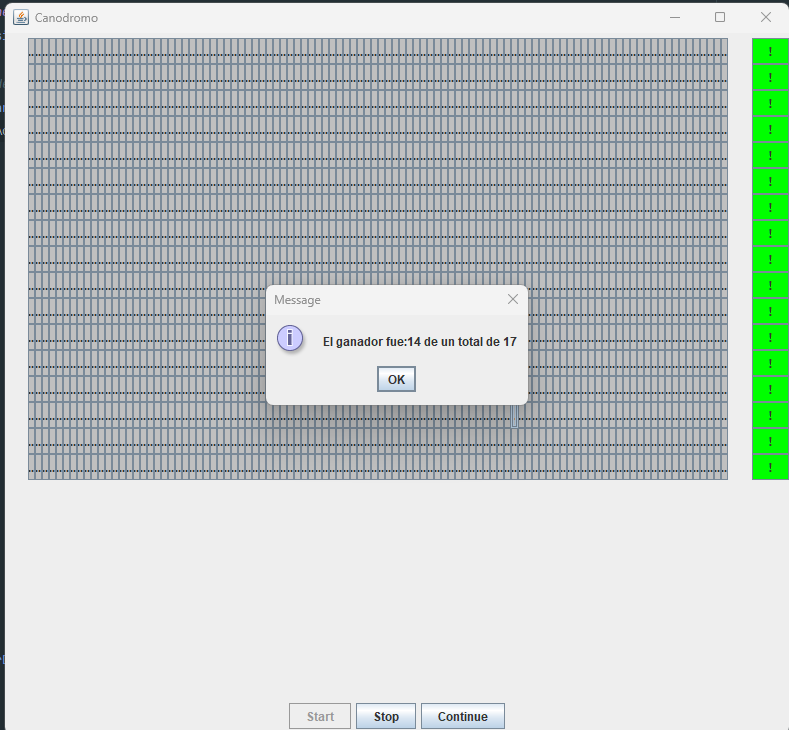
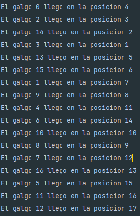
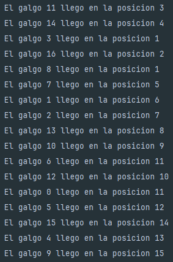
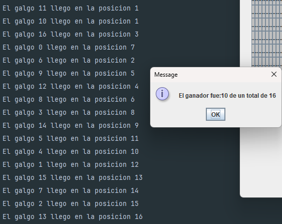

# Escuela Colombiana de Ingeniería

## Arquitecturas de Software – ARSW

### Taller – programación concurrente, condiciones de carrera y sincronización de hilos.

#### Parte I – Antes de terminar la clase.

##### Andres Jacobo Sepulveda & Juan Esteban Cely 

Creación, puesta en marcha y coordinación de hilos.

**1.** Revise el programa “primos concurrentes” (en la carpeta parte1), dispuesto en el paquete edu.eci.arsw.primefinder. Este es un programa que calcula los números primos entre dos intervalos, distribuyendo la búsqueda de los mismos entre hilos independientes. Por ahora, tiene un único hilo de ejecución que busca los primos entre 0 y 30.000.000. Ejecútelo, abra el administrador de procesos del sistema operativo, y verifique cuantos núcleos son usados por el mismo.

**Antes de correr**


**Despues de ejecutar Con el maximo valor de Integer**


**2.** Modifique el programa para que, en lugar de resolver el problema con un solo hilo, lo haga con tres, donde cada uno de éstos hará la tarcera parte del problema original. Verifique nuevamente el funcionamiento, y nuevamente revise el uso de los núcleos del equipo.


**3.** Lo que se le ha pedido es: debe modificar la aplicación de manera que cuando hayan transcurrido 5 segundos desde que se inició la ejecución, se detengan todos los hilos y se muestre el número de primos encontrados hasta el momento. Luego, se debe esperar a que el usuario presione ENTER para reanudar la ejecución de los mismo.


Para esta parte lo que hicimos fue implementar una TimerTask para controlar la pausa y reanudación de cada hilo, asegurando que el proceso pueda detenerse después de un tiempo y reanudarse con la entrada del usuario que en este caso debe ser al darle a la tecla "enter":


#####Parte II 


Para este ejercicio se va a trabajar con un simulador de carreras de galgos (carpeta parte2), cuya representación gráfica corresponde a la siguiente figura:


En la simulación, todos los galgos tienen la misma velocidad (a nivel de programación), por lo que el galgo ganador será aquel que (por cuestiones del azar) haya sido más beneficiado por el *scheduling* del
procesador (es decir, al que más ciclos de CPU se le haya otorgado durante la carrera). El modelo de la aplicación es el siguiente:


Como se observa, los galgos son objetos ‘hilo’ (Thread), y el avance de los mismos es visualizado en la clase Canodromo, que es básicamente un formulario Swing. Todos los galgos (por defecto son 17 galgos corriendo en una pista de 100 metros) comparten el acceso a un objeto de tipo
RegistroLLegada. Cuando un galgo llega a la meta, accede al contador ubicado en dicho objeto (cuyo valor inicial es 1), y toma dicho valor como su posición de llegada, y luego lo incrementa en 1. El galgo que
logre tomar el ‘1’ será el ganador.

Al iniciar la aplicación, hay un primer error evidente: los resultados (total recorrido y número del galgo ganador) son mostrados antes de que finalice la carrera como tal. Sin embargo, es posible que una vez corregido esto, haya más inconsistencias causadas por la presencia de condiciones de carrera.

Taller.

1.  Corrija la aplicación para que el aviso de resultados se muestre
    sólo cuando la ejecución de todos los hilos ‘galgo’ haya finalizado.
    Para esto tenga en cuenta:
    
    a. La acción de iniciar la carrera y mostrar los resultados se realiza a partir de la línea 38 de MainCanodromo.

    Como se puede ver lo que pasa es que al momento de iniciar la carrera se anuncia el ganador, pero como ningun galgo ha llegado a la meta siempre se muestra null.

    

    

    b. Puede utilizarse el método join() de la clase Thread para sincronizar el hilo que inicia la carrera, con la finalización de los hilos de los galgos.
    
    Lo que hicimos fue agregar un ciclo en el que por cada galgo que es representado por un hilo se le agregue un ```join()``` de manera que el hilo principal que lanza la carrera
    se pausa hasta que el galgo haya completado su ejecución, de esta manera se garantiza que el ganador solo se anuncie cuando la carrera acabe.

    

    

   3.  Una vez corregido el problema inicial, corra la aplicación varias
       veces, e identifique las inconsistencias en los resultados de las
       mismas viendo el ‘ranking’ mostrado en consola (algunas veces
       podrían salir resultados válidos, pero en otros se pueden presentar
       dichas inconsistencias). A partir de esto, identifique las regiones
       críticas () del programa.
    
       En el primer intento todo ocurrió sin ninguna inconsistencia, todos los galgos llegaron y se declaró a un ganador.

       

       En el segundo si ocurrieron cosas raras debido a que algunos galgos compartían misma posición con otros, si bien es cierto que 
       el mensaje de ganador daba como vencedor a uno de los galgos que quedaron de primeras, cada galgo debería tener su propia posición por más 
       que el tiempo entre estos sea muy cercano.

       

       En el ultímo intento ocurrió algo similar al caso anterior, pero en este sí que hubo inconsistencias al momento de anunciar al 
       ganador por pantalla, ya que solo contaban 16 galgos cuando deberían ser 17, estos se debe a que dos galgos se contaron como ganadores.

       

       En base a esto las regiones críticas que identificamos son:

        1. Actualización de la posición de llegada
           
            ```
            int ubicacion = regl.getUltimaPosicionAlcanzada();
            regl.setUltimaPosicionAlcanzada(ubicacion + 1);
            ```

            Aquí múltiples hilos leen el mismo valor de ultimaPosicionAlcanzada y lo incrementan en paralelo, provocando que dos galgos obtengan la misma posición.

        3. Determinación del ganador
           
            ```
            if (ubicacion == 1) {
                regl.setGanador(this.getName());
            }
            ```

            Como la condición y la asignación no están protegidas, varios galgos pueden “verse” como primeros y declararse ganadores simultáneamente.

        Para corregir estas inconsistencias, es necesario aplicar un mecanismo de sincronización (por ejemplo synchronized, ReentrantLock o variables atómicas) que asegure que solo un hilo a la vez pueda ejecutar estas secciones.

5.  Utilice un mecanismo de sincronización para garantizar que a dichas
    regiones críticas sólo acceda un hilo a la vez. Verifique los
    resultados.
    

**En este caso Decidimos crear un metodo , el cual devuelve la ultima posicion del galgo y ademas la incrementa , lo cual resulta en un solo bloque sincronizado , con un lock en , lo cual nos asegura que cada galgo va a tener una unica posicion, dado que anteriormente se utilizaban metodos separados y no estaban sincroniozados.** 
    


4. Implemente las funcionalidades de pausa y continuar. Con estas,
    cuando se haga clic en ‘Stop’, todos los hilos de los galgos
    deberían dormirse, y cuando se haga clic en ‘Continue’ los mismos
    deberían despertarse y continuar con la carrera. Diseñe una solución que permita hacer esto utilizando los mecanismos de sincronización con las primitivas de los Locks provistos por el lenguaje (wait y notifyAll).


En esta solución, se implementa un mecanismo de pausa y reanudación centralizado mediante la clase PauseControl, que actúa como monitor compartido entre todos los hilos Galgo. Esta clase mantiene una bandera paused y expone tres métodos sincronizados: pauseAll() para activar la pausa, resumeAll() para desactivarla y despertar a todos los hilos con notifyAll(), y checkPaused() que bloquea el hilo en wait() mientras la bandera esté activa. Cada Galgo recibe una referencia a este monitor y, dentro de su bucle de carrera (corra()), invoca checkPaused() en cada iteración, garantizando que pueda detenerse en cualquier momento y reanudarse de forma inmediata cuando se llame a resumeAll(). En MainCanodromo, los botones Stop y Continue simplemente llaman a pauseAll() y resumeAll() respectivamente, logrando que todos los hilos se sincronicen con una sola llamada, evitando recorrerlos individualmente y asegurando un control limpio, eficiente y libre de condiciones de carrera.


## Criterios de evaluación

1. Funcionalidad.

    1.x1. La ejecución de los galgos puede ser detenida y resumida consistentemente.
    
    1.2. No hay inconsistencias en el orden de llegada registrado.
    
2. Diseño.   

    2.1. Se hace una sincronización de sólo la región crítica (sincronizar, por ejemplo, todo un método, bloquearía más de lo necesario).
    
    2.2. Los galgos, cuando están suspendidos, son reactivados son sólo un llamado (usando un monitor común).

